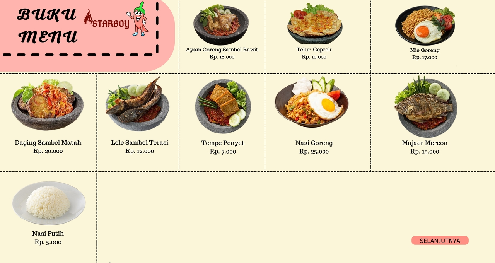

# 🏪 Restoran Starboy - POS & Ordering System

Aplikasi manajemen pemesanan dan kasir (Point of Sales) berbasis desktop yang dirancang khusus untuk **Restoran Starboy**. Proyek ini dibuat menggunakan bahasa pemrograman **Python** dengan antarmuka grafis (**Tkinter**). Dibuat sebagai tugas proyek pertama untuk mata kuliah **Pemrograman Dasar** (Ujian Akhir Semester / UAS).

---

## 📌 Deskripsi Proyek
Aplikasi Restoran Starboy dirancang untuk mendigitalkan proses pemesanan makanan, transaksi pembayaran, serta pelaporan keuangan harian dan bulanan. Aplikasi ini mendukung 3 peran pengguna utama (Multi-Role): **Pelanggan**, **Pegawai (Kasir)**, dan **Pemilik (Owner)** dengan fungsi dan otorisasi yang berbeda.

---

## 🚀 Fitur Utama

### 1. 👤 Fitur Pelanggan (Customer Self-Service)
* **Input Nama**: Mengidentifikasi pemesan sebelum memesan menu.
* **Pemesanan Interaktif**: Menu terbagi menjadi 3 kategori utama:
  * 🍔 **Makanan** (Ayam Goreng, Telur Geprek, Mie Goreng, dll.)
  * 🥤 **Minuman** (Es Jeruk, Es Blewah, Jus Alpukat, dll.)
  * 🍟 **Jajan/Cemilan** (Hot Dog, Cireng, Burger, dll.)
* **Sistem Keranjang**: Menambah (`+`) atau mengurangi (`-`) jumlah pesanan secara dinamis.
* **Rincian Pembayaran**: Menampilkan total harga dengan format mata uang Rupiah (`Rp.`).
* **Metode Pembayaran**: Mendukung pembayaran via **BRI**, **Tunai**, dan **QRIS**.
* **Struk Belanja**: Menghasilkan kode struk unik berbasis waktu (`DDMMHHMMSS`) dan menyimpannya dalam format teks (`.txt`).

### 2. 👥 Fitur Pegawai (Cashier)
* **Login Pegawai**: Keamanan akses menggunakan akun yang terdaftar di database teks (`akun/akun_pegawai.txt`).
* **Pencarian Struk**: Mencari struk pelanggan berdasarkan kode struk unik untuk diproses.
* **Simulasi Cetak Struk**: Memiliki fitur visual cetak struk lengkap dengan progress bar simulasi.
* **Riwayat Penjualan**: Melihat riwayat lengkap pembeli dan menyimpannya langsung dari aplikasi.
* **Rekap Bulanan**: Mengakses rekapitulasi data penjualan dalam format Excel (`.xlsx`).

### 3. 👑 Fitur Pemilik (Owner)
* **Login Pemilik**: Akun khusus pemilik (Default: `dany` / `dany123`).
* **Laporan Penjualan Real-Time**:
  * 📅 **Laporan Harian**: Melihat rekap penjualan hari ini (sistem otomatis melakukan reset data jika program dijalankan di hari berikutnya).
  * 📊 **Laporan Bulanan**: Membaca grafik/data penjualan bulanan langsung dari file spreadsheet Excel (`openpyxl`).

---

## 🛠️ Teknologi yang Digunakan
* **Bahasa Pemrograman:** Python 3.12+
* **Antarmuka Grafis (GUI):** Tkinter
* **Pengolahan Gambar:** Pillow (PIL)
* **Manajemen Spreadsheet:** Openpyxl (untuk pelaporan rekapitulasi penjualan Excel)
* **Pustaka Pendukung:** `datetime`, `time`, `locale`, `os`

---

## 📂 Struktur Direktori Proyek
```text
PROJEK UAS/
│
├── main.py                 # File utama untuk menjalankan aplikasi
├── menu_utama.py           # Kelas Mixin untuk halaman beranda / pilihan role
├── pelanggan.py            # Logika dan GUI untuk pemesanan pelanggan
├── pegawai.py              # Logika dan GUI untuk kasir / cetak struk
├── pemilik.py              # Logika dan GUI untuk pemilik / rekapitulasi penjualan
│
├── akun/
│   └── akun_pegawai.txt    # Data akun login untuk pegawai (format: NAMA:SANDI)
│
├── data_pelanggan/
│   ├── riwayat_pembeli.txt # Log histori seluruh pesanan pelanggan
│   ├── REKAP_HARIAN.xlsx   # File Excel rekap penjualan harian
│   ├── last_run.txt        # Penyimpan tanggal untuk pengecekan reset harian
│   └── [KodeStruk].txt     # File struk belanja masing-masing transaksi
│
├── data_rekap_bulanan/
│   └── Rekap Bulanan.xlsx  # File Excel rekap penjualan bulanan
│
├── logo/                   # Aset gambar logo (BRI, QRIS, Tunai)
└── tampilan/               # Aset gambar latar belakang dan tata letak GUI
```

---

## 🏁 Cara Menjalankan Aplikasi

### Prerequisites (Prasyarat)
Pastikan Anda sudah menginstal **Python 3** di komputer Anda.

### 1. Clone Repository
```bash
git clone https://github.com/username/restoran-starboy.git
cd restoran-starboy
```

### 2. Instal Dependensi
Gunakan pip untuk menginstal pustaka eksternal yang dibutuhkan (`Pillow` & `openpyxl`):
```bash
pip install pillow openpyxl
```

### 3. Jalankan Aplikasi
Jalankan file `main.py` menggunakan terminal atau IDE Anda:
```bash
python main.py
```

---

## 🔑 Kredensial Login Bawaan

| Peran (Role) | Username/Email | Kata Sandi (Password) |
| :--- | :--- | :--- |
| **Pemilik (Owner)** | `dany` | `dany123` |
| **Pegawai (Kasir)** | *(Lihat daftar di `akun/akun_pegawai.txt`)* | *(Sesuai daftar akun)* |

---

## 📸 Tampilan Aplikasi
*(Tambahkan screenshot antarmuka aplikasi Anda di bawah ini agar halaman GitHub tampak lebih menarik)*

| Halaman Utama | Menu Pemesanan Pelanggan |
| :---: | :---: |
|  |  |

---

## 👨‍💻 Kontributor
* **Akhmad dany** - NIM: `23031554234` - Universitas Negeri Surabaya
